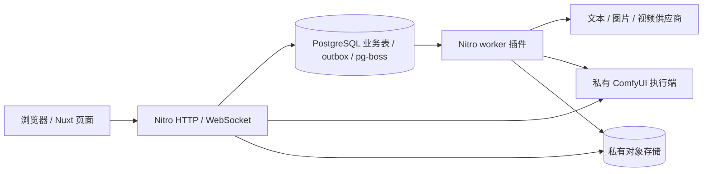

# 系统设计

本文按 2026-09-22 仓库实现整理。行为合同见 [spec](spec/README.md)，部署可用性与验证结果见 [检查记录](docs/project-audit.md)。

## 产品与页面边界

绘小宙把文本、图片、视频和管理员工作流纳入统一任务与作品索引。创作台允许选择模型、编辑输入、确认报价、提交后台任务，再恢复进度或查看作品。`/writing` 重定向到 `/studio`，`/workflow` 重定向到 `/studio/workflow` 并保留查询参数。

项目负责聚合与所有权，文档负责可编辑内容，任务负责执行和费用，作品负责展示索引。四者不能互相替代。模型资产表不代表已有训练、上传部署或自动下载能力。

## 运行拓扑

开发时同一 Nuxt 进程可同时处理 Web 和队列，PostgreSQL 与 SeaweedFS 由开发 Compose 提供。容器部署 Compose 拆成 db-init、web、worker、postgres、comfyui，Web 关闭 worker 开关，worker 使用同一构建但不发布端口。对象存储由外部提供；ComfyUI 模型只读挂载，输入/输出/临时文件使用独立卷。

生产配置要求 ComfyUI remote 地址，即使主要使用云端生成，也不能把现有 Compose 解释为无 GPU 的完整部署方案。镜像包含当前 schema、初始化脚本和内置工作流预设。

## 模块职责

| 层         | 代码                                                        | 责任                                            |
| ---------- | ----------------------------------------------------------- | ----------------------------------------------- |
| 页面与交互 | `app/pages/`、`app/components/`、`app/composables/`         | 表单、报价确认、轮询、文档编辑、作品和管理界面  |
| 接口边界   | `server/api/`、`server/middleware/`、`server/routes/`       | 鉴权、请求校验、错误封装、ComfyUI WS 代理       |
| 平台服务   | `server/services/platform/`                                 | 连接版本、报价/受理、文档版本、跨模态作品和归档 |
| 视频执行   | `billing.ts`、`generation-worker.ts`、`generation-store.ts` | 保留既有视频状态与结算语义                      |
| 外部适配   | `server/services/providers/`、`server/services/comfyui/`    | 供应商协议、能力约束、执行端生命周期与私有连接  |
| 持久化     | `server/database/`、`server/utils/oss.ts`                   | PostgreSQL、pg-boss、限流与对象存储访问         |
| 执行节点   | `comfyui/custom_nodes/huezumi_prompt/`                      | 图片、提示词 Agent、百炼视频及任务级连接上下文  |

## 数据模型

| 领域       | 表                                                                      | 不变量                                                         |
| ---------- | ----------------------------------------------------------------------- | -------------------------------------------------------------- |
| 身份       | `users`、`sessions`、`invitation_codes`                                 | 用户状态和权限在服务端判定；session 存 token hash              |
| 额度       | `wallets`、`ledger_entries`、`quotes`、`pricing_rules`、`text_prices`   | 可用额度 = 余额 − 预留；账本幂等键唯一；报价快照不随新价格变化 |
| 连接       | `platform_connections`、`connection_versions`、`platform_settings`      | 稳定身份与不可变版本分开，主密钥独立于数据库                   |
| 文档       | `creative_projects`、`creative_documents`、`creative_document_versions` | owner 隔离；文档当前指针与不可变内容版本分开                   |
| 执行       | `runs`、`generations`、`comfy_executions`、`outbox_events`              | runs 统一身份，视频状态仍以 generations 为准                   |
| 作品和媒体 | `works`、`assets`、`asset_reservations`                                 | 作品保存引用与可用性；字节位于私有存储，按 owner 读取          |
| 运维       | `audit_logs`、`rate_limit_buckets`                                      | 管理操作可追踪，限流在 PostgreSQL 原子更新                     |
| 模型元数据 | `model_assets`、`model_asset_files`                                     | 与普通参考图素材分开；部署能力尚未完成                         |

完整列、索引和枚举以 [schema.ts](server/database/schema.ts) 为准。不是每个逻辑关联都有数据库外键，服务层仍必须验证归属与引用。

## 付费任务流程

1. `/api/billing/quotes` 校验 owner、模型、能力、素材和价格，返回规范化 `request` 与十分钟报价，固定连接版本。
2. `/api/runs` 接收原样 request、quoteId 和幂等键。在受理事务中检查用户活动任务、平台日预算、钱包，写任务、预留流水与 outbox；相同 owner/幂等键/请求返回原任务。
3. outbox 投递 pg-boss；worker 使用 singleton key 和 PostgreSQL advisory lock 串行处理同一任务。运行期不自动改 schema；启动前由 db-init 完成结构与队列初始化。
4. 文本保存不可变版本与结算在同一事务；图片先持久化上游结果 URL 并按实际张数结算，再归档；视频保留原有异步提交、轮询、结算与归档流程。
5. 已提交但结果不明确时转人工核对，不重新调用生成接口。归档失败与生成失败分开；`allowedActions` 决定能否同步或重试保存。

`status`（PENDING/RUNNING/SUCCEEDED/FAILED/UNKNOWN）、执行阶段、结算状态和作品可用性是不同维度。图片 `SUCCEEDED` 仍可能处于 `archiving`，作品可标记 `unavailable`；不能仅依据生成成功展示“已保存”。

## 文档与派生创作

手动保存附带 `baseVersionId`，不匹配当前指针则返回 409。AI 开始时固定基础版本，完成时若用户已编辑，则保存候选版本并设置 `needsReview`，保留用户当前版本。派生视频引用 `sourceVersionId` 和可选来源片段，用户之后改稿不会重写既有任务输入。

## 管理员工作流

平台先持久化 prompt ID 和执行意图，再提交 ComfyUI。工作流使用独立提交接口，不通过普通付费报价入口；平台额度结算为 `exempt`，外部 API 仍可能收费。worker 查询引擎历史，登记去重后的输出，再归档到私有对象存储。作品列表不依赖实时引擎查询；已归档媒体不依赖原始 output 卷，未归档输出的重试仍需要源文件。

平台按节点用途读取后台连接，在执行端支持私有连接后，经敏感数据槽注入任务上下文。Agent、图片、工作流视频各有用途分配；任务结束清理上下文。旧手动 `HuezumiLLMConfig` 仍可兼容，但其凭据会进入工作流副本，不应用于公开模板。独立 ComfyUI 的环境配置不作为平台任务的隐式回退。

## 身份与存储

会话 Cookie 为 `huezumi_session`，HttpOnly、SameSite=Lax，生产 Secure。写请求若带 Origin 则校验同源；无 Origin 的请求继续走正常身份校验。资源 API 通过 owner 查找，管理和 ComfyUI 通过 admin 检查。API 错误包含 `data.code`、`data.message`、`data.requestId` 与 `x-request-id`。

连接凭据使用 AES-256-GCM，主密钥为 Base64 编码的 32 字节随机值。连接修改产生新版本；撤销版本会影响未完成任务，不能靠更换环境主密钥实现 API Key 轮换。

新上传和归档对象私有，数据库保存 key，平台提供鉴权媒体接口和短期签名 URL。SeaweedFS 用 S3 协议，阿里云 OSS 使用相应适配。历史本地媒体路径仍保留兼容读取。公网供应商需要能访问输入签名 URL，本地 HTTP 存储不满足这一条件。

## 界面设计

全站品牌为「绘小宙」，基础 UI 使用奶油白、暖珊瑚与深棕文本，暗色使用棕黑背景。颜色、字体、圆角和阴影以 [main.css](app/assets/css/main.css) 为准，Nuxt UI 组件配置在 [app.config.ts](app/app.config.ts)。首页插画允许多色和不同媒介，不把历史提示词中的暖色限制扩展为全站约束。

导航由 `app/utils/app-navigation.ts` 集中维护。普通用户看到文本、视频和图片创作；高级工作流和管理入口仅对管理员显示。后台编辑使用临时草稿，失败保留输入，成功刷新摘要；凭据不回显。输出预览保持原始比例，模态支持关闭与 Escape。动效需兼顾减少动态效果偏好，状态不能仅靠颜色表达。

文案、图片与视频创作共用 `StudioWorkspace`：顶部切换创作类型，桌面左侧输入与参数、右侧结果，窄屏按输入、结果顺序排列。模型与常用规格直接显示，风格、项目和高级参数通过“更多设置”打开。输入区提供灵感示例，已有描述时追加而不覆盖。共用操作栏先获取报价，再确认生成；在输入区使用 Ctrl / ⌘ + Enter 可触发当前步骤，弹窗内不触发。提交中与生成中的任务禁用重复操作；修改参数使报价失效，请求期间变更输入时丢弃过时的报价。视频未知结果显示待核对，不显示虚构的完成百分比。

## 已知限制与演进

- 开发期使用 schema push，不维护历史迁移。初始化、检查和镜像交付约定见 [仓库完整性规格](spec/2026-09-22-repository-integrity.md)。
- 图像 API、ComfyUI 本地 Qwen 与视频供应商分别有能力边界，不能因界面中出现模型名推断运行环境已经可用。
- 无自动端到端浏览器验收入口；本轮构建、测试结论不覆盖真实采购账单、GPU 与生产恢复演练。
- 历史决策及取代关系见 [ADR 索引](docs/decisions/README.md)，不要按早期公开 OSS 或 Redis 方案配置当前系统。
